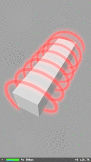

# SCNTechniqueTest
Working example of SCNTechnique and Metal. Renders a SceneKit scene that is then run through several linear (horizontal and vertical) Guassian blur fragment shaders.

*Note:* The `program` key for pass definitions in the plist must be specified even though it is ignored when using Metal (Metal instead uses the `metalVertexShader` and `metalFragmentShader`).

# License
MIT
